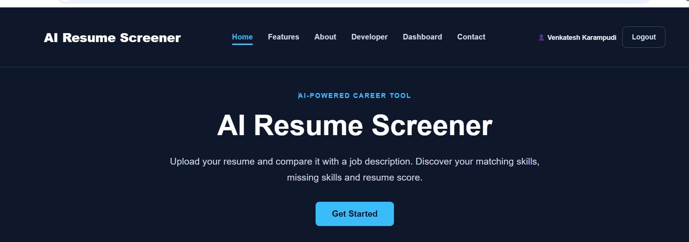
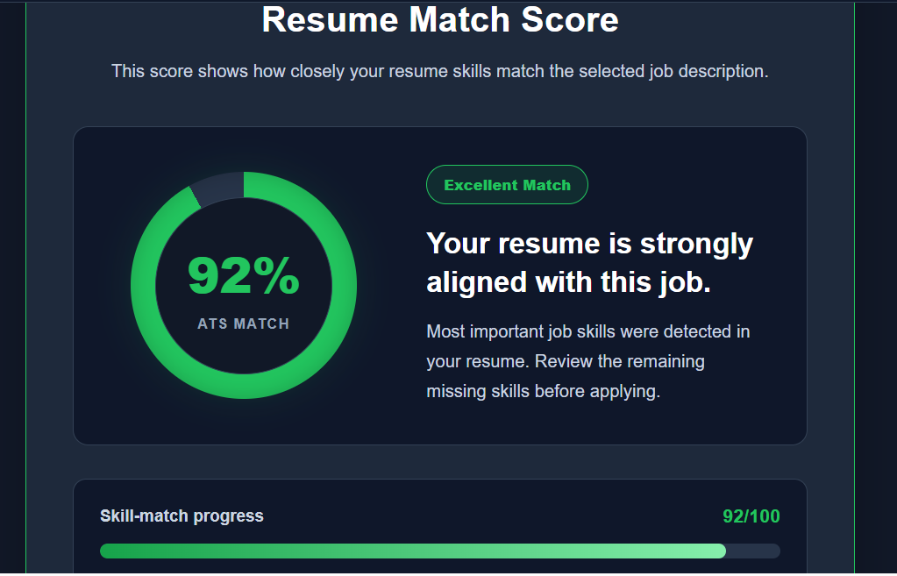
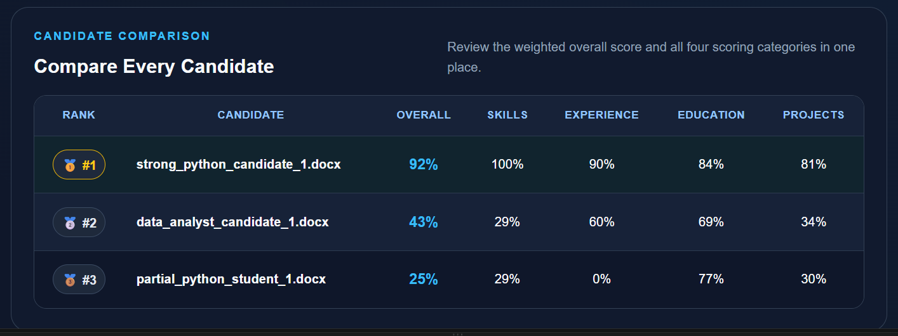
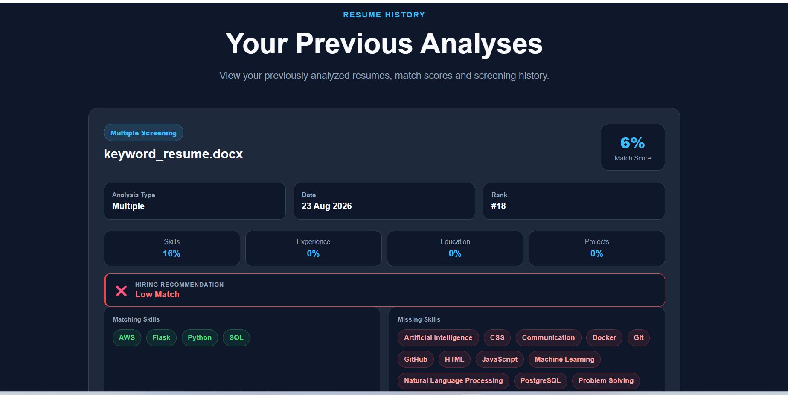
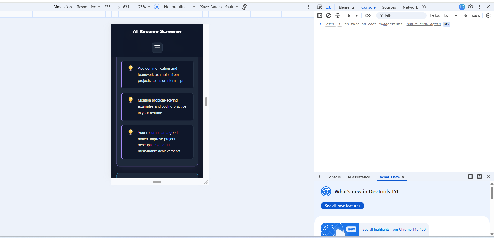

# AI Resume Screener V2

An intelligent Flask application for evidence-based resume analysis, candidate ranking, explainable scoring and truthful resume rewriting.

## Live Demo and Source Code

- **Live Demo:** [https://ai-resume-screener-0nwr.onrender.com](https://ai-resume-screener-0nwr.onrender.com)
- **GitHub Repository:** [https://github.com/venkycodesdev/AI-Resume-Screener](https://github.com/venkycodesdev/AI-Resume-Screener)

> The live URL will show V2 after the updated code is pushed and Render completes deployment.

## Version 2 Features

- Saved Reports page with filename search, analysis-type filtering, minimum-score filtering and sorting
- Secure report download, deletion and user-data isolation
- Explainable scores with detected evidence and improvement areas
- Truthful Resume Rewriter with professional, concise, technical and fresher-friendly tones
- Side-by-side original and improved resume editor
- Improved-resume downloads in DOCX and PDF formats
- Re-analysis of the improved resume
- Recruiter-controlled scoring weights with strict 100% validation
- Candidate search, score/recommendation filters and category sorting
- Automated pytest coverage and GitHub Actions on every push

The rewriter improves wording but does not invent skills, employers, qualifications, achievements or measurements. Every rewritten statement must be reviewed by the user.

## Existing Features

- PDF and DOCX resume upload and secure file validation
- Pasted or uploaded job descriptions
- Single-resume analysis
- Multiple-resume comparison and candidate ranking
- Skills, experience, projects and education scores
- Matching and missing skill detection
- Candidate strengths, weaknesses and hiring recommendations
- Personalized interview-question generation
- Saved analysis history
- Downloadable analysis and recruiter PDF reports
- Registration, login, logout and per-user data isolation
- PostgreSQL production database with SQLite local fallback
- Responsive desktop, tablet and mobile interface

## Default Scoring

| Category | Default weight |
| --- | ---: |
| Skills match | 40% |
| Experience relevance | 30% |
| Projects relevance | 20% |
| Education match | 10% |

Recruiters can change these values from **Dashboard → Scoring Weights**. The total must equal exactly 100% and the saved weights apply to both single and multiple-resume analysis.

## Technology Stack

- Python and Flask
- Flask-Login and Flask-SQLAlchemy
- PostgreSQL in production; SQLite locally
- pdfplumber and python-docx for resume extraction
- ReportLab and python-docx for PDF/DOCX exports
- HTML, CSS, JavaScript and Jinja templates
- pytest and GitHub Actions
- Gunicorn and Render

## Project Structure

```text
AI-Resume-Screener/
├── app.py
├── v2_features.py
├── requirements.txt
├── README.md
├── .github/workflows/tests.yml
├── static/
│   ├── css/style.css
│   └── js/script.js
├── templates/
│   ├── index.html
│   ├── dashboard.html
│   ├── reports.html
│   ├── scoring_weights.html
│   ├── rewrite.html
│   ├── reanalyze_result.html
│   ├── multiple_resume.html
│   ├── history.html
│   └── analysis_details.html
├── tests/test_v2.py
└── uploads/.gitkeep
```

## Local Installation

```powershell
git clone https://github.com/venkycodesdev/AI-Resume-Screener.git
cd AI-Resume-Screener
python -m venv venv
.\venv\Scripts\Activate.ps1
pip install -r requirements.txt
python app.py
```

Open [http://127.0.0.1:5000](http://127.0.0.1:5000).

### Environment variables

```text
SECRET_KEY=replace-with-a-long-random-secret
DATABASE_URL=postgresql://...
FLASK_DEBUG=0
```

`DATABASE_URL` is optional locally. Never commit `.env`, database files, credentials or uploaded private resumes.

## Database Upgrade

V2 keeps the existing `user` and `analysis` tables unchanged. On first startup, `db.create_all()` safely creates:

- `scoring_preference`
- `analysis_context`
- `resume_rewrite`

Existing history remains available. Resume rewriting requires the original extracted text, so analyses created before V2 must be analyzed once again to enable rewriting.

## Testing

```powershell
python -m py_compile app.py v2_features.py
python -m pytest -q
```

GitHub Actions runs the same compilation and test checks automatically.

## Screenshots

### Home Page



### Single Resume Analysis



### Candidate Comparison and Ranking



### Resume History



### Mobile Responsive Design



## Deployment

1. Push the V2 files to the GitHub `version-2` branch.
2. Confirm the **Automated Tests** workflow passes.
3. Merge `version-2` into `main`.
4. Render deploys `main` automatically.
5. Open the live site and test register/login, analysis, reports, rewriting, downloads, custom weights and multiple-candidate filters.

## Author

- GitHub: [venkycodesdev](https://github.com/venkycodesdev)
- Live Project: [AI Resume Screener](https://ai-resume-screener-0nwr.onrender.com)
